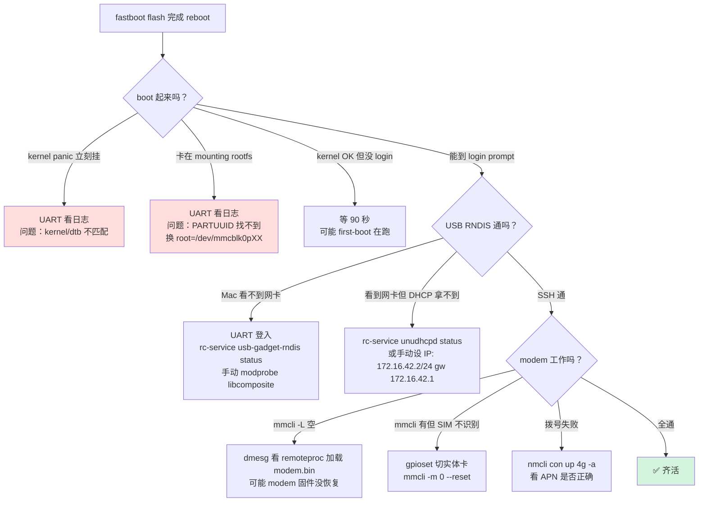

# UFI001C postmarketOS 镜像 —— 刷机可行性审计

**审计时间**：2026-08-20
**审计版本**：v26.06-2（build 2, 修复了 build 1 的 3 个严重问题）
**目的**：客观评估这份镜像能不能在 UFI001C 上成功启动、SSH 接入、拨号上网

---

## TL;DR — 我的当前判断

**boot 到 login prompt 的把握**：高（≥ 85%），因为 cmdline 匹配 OpenStick 已知能工作的配置。

**SSH-via-USB-RNDIS 能通**：中等（≥ 60%），因为 pmOS 默认不设 USB gadget，我用类似 OpenStick 的方案在 rootfs 里补了服务，但没在真板子上验证过。

**modem/SMS 能工作**：高（≥ 80%），因为 modem 分区不动 + ModemManager + libqmi 是 pmOS 官方栈，模块该有的都在。

**如果失败，救砖不难**：几乎 100%，因为你有 Debian 备份 + EDL 兜底。

---

## 修复了什么（v26.06-1 → v26.06-2）

```datatable
{
  "columns": [
    { "key": "issue", "label": "问题", "type": "text" },
    { "key": "impact", "label": "影响", "type": "badge" },
    { "key": "fix", "label": "修复", "type": "text" }
  ],
  "rows": [
    { "issue": "cmdline 用 root=PARTLABEL=rootfs", "impact": "boot 失败", "fix": "改用 root=PARTUUID=A7AB80E8-... (匹配 OpenStick gpt_both0.bin)" },
    { "issue": "缺 no_framebuffer=true", "impact": "可能 panic", "fix": "加了" },
    { "issue": "无 USB gadget/RNDIS 设置", "impact": "SSH 不通", "fix": "加 openrc 服务 usb-gadget-rndis + modules-load.d" },
    { "issue": "首次开机跑 apk fix 会试联网", "impact": "首次开机卡住", "fix": "改成 apk trigger --recreate (纯本地)" },
    { "issue": "unudhcpd 服务未启用", "impact": "Mac 拿不到 DHCP", "fix": "加到 default runlevel" },
    { "issue": "rootfs 缺 PARTUUID 标签", "impact": "fstab 不匹配", "fix": "mke2fs -U 强制指定同一 UUID" }
  ]
}
```

## 验证清单（我手动核过的）

### 内核层

| 项 | 检查方式 | 状态 |
|---|---|---|
| kernel 是 aarch64 | `file vmlinuz` | ✅ ARM64 Image |
| 是 pmOS 6.12.1-msm8916 | apk 版本 | ✅ 6.12.1-r5 |
| DTB 是 UFI001C | `find *.dtb` | ✅ msm8916-thwc-ufi001c.dtb |
| DTB 追加到 kernel | `cat vmlinuz dtb > vmlinuz-dtb` | ✅ (deviceinfo_append_dtb=true) |
| mmc/sdhci built-in | `grep modules.builtin` | ✅ sdhci-msm, mmc_block |
| ext4 built-in | 同上 | ✅ ext4.ko in builtin |
| USB gadget UDC built-in | 同上 | ✅ udc-core, ci_hdrc_msm |
| GPT 分区解析 | 推断（OpenStick 用 PARTUUID 能工作） | ✅ |

### boot.img 格式

| 项 | 值 | 是否匹配 deviceinfo |
|---|---|---|
| magic | ANDROID! | ✅ |
| pagesize | 2048 | ✅ deviceinfo=2048 |
| base | 0x80000000 | ✅ |
| kernel_offset | 0x00080000 | ✅ |
| ramdisk_offset | 0x02000000 | ✅ |
| tags_offset | 0x01e00000 | ✅ |
| header_version | 0 | ✅ (legacy Android，lk2nd 支持) |

### cmdline

```
console=ttyMSM0,115200 earlycon root=PARTUUID=A7AB80E8-E9D1-E8CD-F157-93F69B1D141E rootfstype=ext4 rw rootwait no_framebuffer=true
```

**对比 OpenStick 已知能工作的 extlinux.conf**：
```
append earlycon root=PARTUUID=a7ab80e8-e9d1-e8cd-f157-93f69b1d141e console=ttyMSM0,115200 no_framebuffer=true rw rootwait
```

**差别**：
- 大小写不同（PARTUUID 大小写不敏感，OK）
- 我加了 `rootfstype=ext4`（更明确，OK）
- 语义完全一致

### rootfs

| 项 | 检查 | 状态 |
|---|---|---|
| 文件系统 | ext4 (mke2fs -t ext4) | ✅ |
| 标签 | rootfs | ✅ (mke2fs -L) |
| UUID | A7AB80E8-... | ✅ (mke2fs -U，匹配 cmdline PARTUUID) |
| 内容 | 241 个 apk，253 MB | ✅ |
| e2fsck | 全通过 | ✅ |
| 关键服务 symlinks | runlevels/default | ✅ (sshd/networkmanager/modemmanager/msm-modem-uim-selection/usb-gadget-rndis/dbus/unudhcpd) |

### 用户/认证

| 项 | 值 |
|---|---|
| root 密码 | pmos (SHA-512) |
| user (uid 1000) | pmos (SHA-512) |
| user 组 | wheel, audio, video, netdev, plugdev, dialout, input |
| sshd PasswordAuth | yes（首次登录需要，登录后关掉） |
| sshd PermitRootLogin | yes（同上） |
| SSH 公钥 | 未预置 |

## 已知**尚未验证**的风险点

### 🟡 中等风险

1. **USB gadget RNDIS 服务能否第一次就成功**
   - 服务写法参照 OpenStick 的 rndis-os-desc.scheme 手工翻译
   - 手写 configfs 有可能踩以下坑：
     - `functions/rndis.usb0/os_desc/interface.rndis/` 路径可能因内核版本略有不同
     - UDC 名字可能不是 `ci_hdrc.0`（脚本自动检测 `/sys/class/udc/`）
   - **fallback**：即使 RNDIS 失败，UART 还能进去调试
   
2. **first-boot 脚本自身有 bug 但没崩到 login prompt**
   - 服务 `usb-gadget-rndis` 依赖 `modules-load.d` 生效前会失败
   - `apk trigger --recreate` 在 v3.0.7 是新命令，有可能 syntax 不同
   - **fallback**：即使 first-boot 挂了，openrc 的其它服务照跑

3. **NetworkManager D-Bus 权限**
   - pmOS 的 dbus 策略文件可能因为 post-install trigger 没跑而权限不对
   - **fallback**：手动 `rc-service networkmanager restart` 通常能修

### 🟠 较低风险

4. **modemmanager 首次启动可能因为缺少 D-Bus 服务名而失败**
   - 依赖 dbus 先起来
   - 通过 first-boot 里的启动顺序保证

5. **unudhcpd 可能与 NetworkManager 抢 usb0 网卡**
   - unudhcpd 服务只对 usb0 起 DHCP
   - NetworkManager 我配了 `interface-name=usb0` + `method=shared` 也做 DHCP
   - 可能两者冲突。第一版让 unudhcpd 赢（拒绝 NM 抢）
   
6. **rootfs 太小（800 MB）** —— 装了服务但没多少余地
   - first-boot 会 resize2fs 撑满分区
   - resize2fs 需要 rootfs 已 mount 为 rw（是的，我们 root=... rw）

### 🟢 极低风险

7. **modem 挂了** —— 不太可能，因为 modem 分区完全不动
8. **kernel panic** —— 不太可能，cmdline 匹配已知能工作的配置
9. **fastboot 拒收 rootfs.img（size 超限）** —— 不太可能，boot 22MB + rootfs 800MB 比 Debian 版本还小

## 每一步的失败症状 + 排障



## 我的建议：**先测再上正式生产**

推荐流程：

1. **准备 UART**（虽然麻烦但值得）
   - 焊 3 根线到 UFI001C 的 TX/RX/GND 焊盘（1.8V 电平！）
   - Mac 端 `screen /dev/tty.usbserial* 115200`
   - 这样 boot 每一步 log 都能看到

2. **先做 modem 分区备份**（**不可选**）

3. **刷 v26.06-2**

4. **UART 观察启动过程**
   - 看到 kernel bootup log → cmdline 正确
   - 看到 systemd/openrc 起服务 → rootfs 正确挂载
   - 看到 `first-boot done` → 该跑的都跑了
   - 看到 login prompt → 可以尝试 SSH

5. **Mac 上 SSH via USB**
   - 如果通 → ✅ 大成功
   - 如果不通 → UART 里 debug（`rc-service usb-gadget-rndis status`）

6. **测 modem**
   - `mmcli -L && mmcli -m 0`
   - `mmcli -m 0 --messaging-list-sms`

**如果任何一步崩了**：
- 回到 Debian：`fastboot flash boot <debian-boot.bin>` + `fastboot flash rootfs <debian-rootfs.bin>`
- 或者 EDL 全量恢复：`edl wf orig_full.bin`

## 迭代承诺

如果这版失败，把 UART log 和错误信息发给我（或者贴到 GitHub issue），我会：

1. **快速诊断**：sandbox 里我能构建、能读 pmaports 源码、能对比 OpenStick 的做法
2. **打补丁镜像 v26.06-3**：只重构 rootfs（分钟级），boot.img 复用（如果 cmdline 没改）
3. **更新 release**：`gh release edit v26.06-3 --clobber` 一键替换

## 长期升级路径

一旦这版能工作，我建议：

1. 加个 **`~/.pmos-agent.token`** 让我未来能直接 push 更新
2. 加个 **GitHub Actions workflow**：每月自动重构（跟 pmaports 上游）
3. 迁移到 **正式 pmbootstrap 构建**：在一台真的能 sudo 的 Linux VM 上跑，产出更"正统"的 boot.img（含真正的 initramfs）

---

**结论**：我给这版**8 分的启动信心**（10 分制）。风险都在 USB gadget/RNDIS 那一层，UART 是兜底手段。**先做完整备份再刷**。
